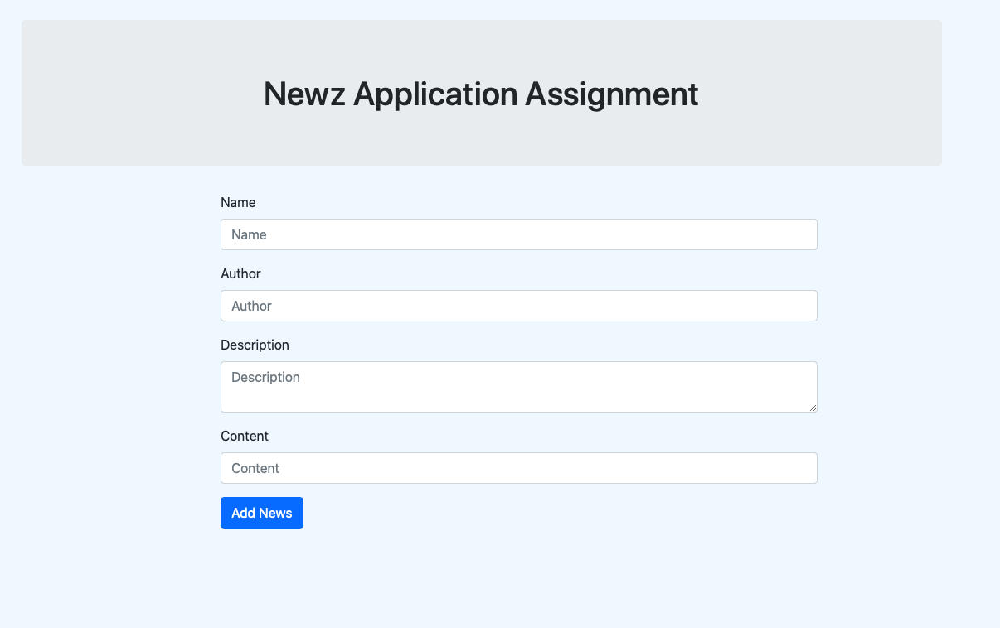
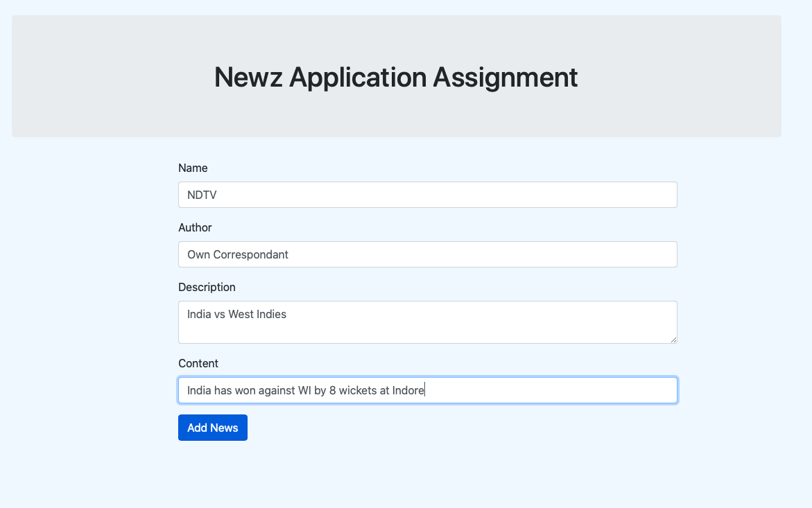
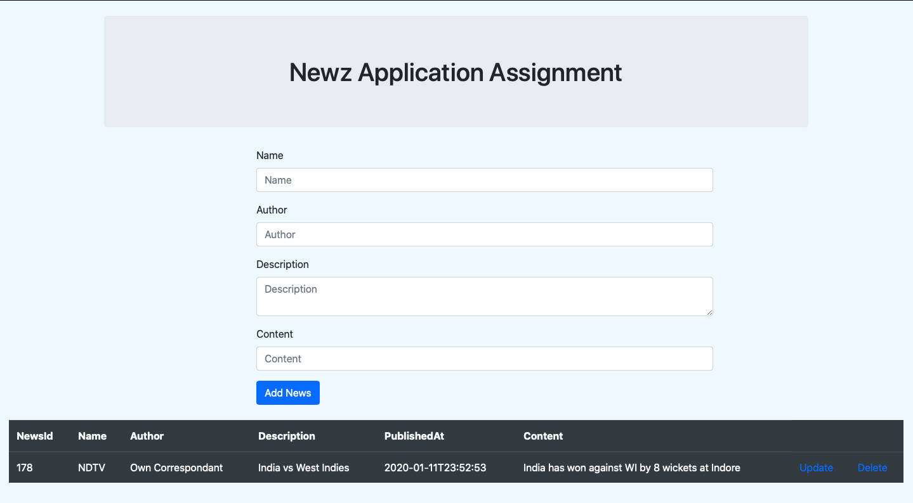
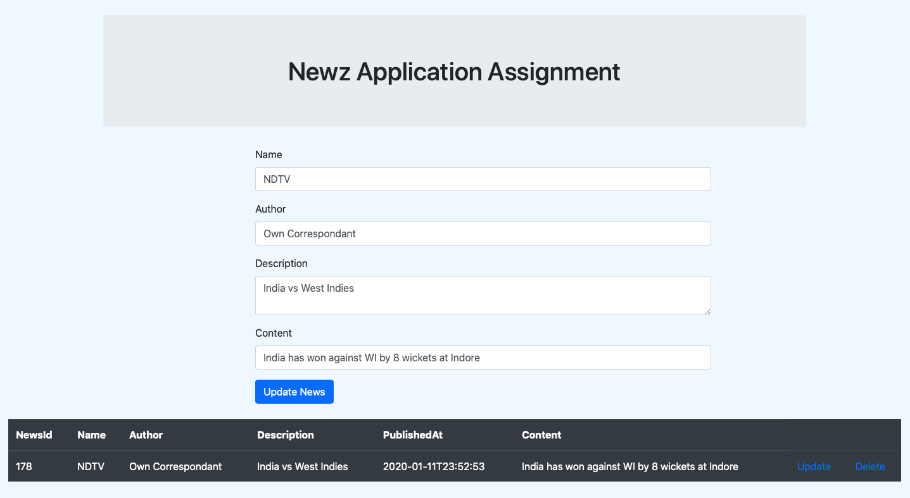

 

## Seed code - Boilerplate for step 2 - Newz Assignment
### Assignment Step Description
In this case study: Newz Step 2, we will create an Application which accepts News Name, News Author, description, content as input from the front end and displays the same along with the LocalDateTime of posting in a reverse chronological order (latest News first). 

Even though functionality-wise and the output of step-1 and step-2 are same, 
 1. In step-1 we created a monolithic application but in this step-2, we will use proper annotations like @Repository, @Autowired etc.,  
 2. In this step-2, we should not use "new"  keyword to create an instance.  
 3. Hibernate was not added in Step-1 but in Step-2 we will use Hibernate.

Here we will have a **News** class which will be acting as the data model for news table in the database. Please note that this class is annotated with **@Entity annotation** (**The @Entity annotation marks the class as an entity bean, so it must have a no-argument constructor that is visible with an at least protected scope**), 
where Hibernate will scan all the packages for any Java objects annotated with the @Entity annotation. 
If it finds any, then it will begin the process of looking through that particular Java object to recreate it as a table in your database. 

### Problem Statement
In this case study: Newz Step 2 we will create an application that requires us to implement four functionalities. They are as follows:
1. Display the list of existing news from the database.
2. Add a new News.
3. Delete existing News.
4. Update/ Modify News.

    
    Note: For detailed clarity on the class files, kindly go through the Project Structure

### Expected solution

A form containing four text fields (News Name, News Author, description, content) and **Add News** button, below to this will be a tabular column with the fields News Name, News Author, description, content and LocalDateTime(This will be published in reverse chronological order). 
When the user enters the News Name, News Author, description, content and clicks on **Add News** button, it gets stored in the database and later renders in the tabular column.

### Screenshots of Expected Solution

 

### Following are the broad tasks:
1. Create the application-context for the application. 
2. Extend AbstractAnnotationConfigDispatcherServletInitializer class WebApplicationInitializer.
3. Create WebMvcConfig which implements WebMvcConfigurer.
3. CRUD (News)
4. Implement the NewsDAO interface and annotate with @Repository annotation in NewsDAOImpl.

### Steps to be followed:

    Step 1: Clone the boilerplate in a specific folder in your local machine and import the same in your eclipse STS.
    Step 2: Add relevant dependencies in pom.xml file. 
        Note: Read the comments mentioned in pom.xml file for identifying the relevant dependencies.
    Step 3: In ApplicationContextConfig.java add the required annotations, as well as add base packages to scan in @componentScan Annotation. Define the bean for DataSource, SessionFactory and Hibernate Transaction Manager.
    Step 4: In WebMvcConfig.java add the required annotations. Define the bean for ViewResolver
    Step 4: Specify Root config and ServletConfig class in WebApplicationInitializer.java file.
    Step 5: In News.java file (which is considered as Model class), annotate this class with @Entity Annotation and add a @Id annotation to specify the primary key for the table.
    Step 6: Read all the methods mentioned in the NewsDAO interface.
    Step 7: Provide the implementation for all the methods of NewsDAO interface in NewsDAOImpl. These classes have to be annotated with @Repository and @Transactional.
    Step 8: Run the test cases for NewsDAOImpl.java class (NewsDAOImplTest.java)
    Step 9: Annotate the NewsController.java class with @Controller annotation, and define handler methods.
    Step 10: Run the test cases for NewsController.java (NewsControllerTest.java)
    Step 11: Design a form.
    Step 12: Run the application on a configured web server.

### Project structure

The folders and files you see in this repositories is how it is expected to be in projects, which are submitted for automated evaluation by Hobbes

    Project
    |
    ├──src/main/java
    |        └── com.stackroute.newz.config               
    |               └── ApplicationContextConfig.java           // This class will contain the application-context for the application.
    |               └── WebApplicationInitializer.java          // This class WebApplicationInitializer extends AbstractAnnotationConfigDispatcherServletInitializer class.             
    				└── WebMvcConfig.java                       // This class will contain bean for viewresolver.
    |        └── com.stackroute.newz.controller
    |               └── NewsController.java                     // This class is used to control all the transactions with the database.                   
    |        └── com.stackroute.newz.dao
    |               └── NewsDAO.java                            // An interface that provides access to an underlying database (News) or any other persistence storage.
    |        		└── NewsDAOImpl.java                        // This class is implementing the NewsDAO interface. This class has to be annotated with @Repository annotation.
    |        └── com.stackroute.newz.model
    |                └── News.java                              // The class will be acting as the data model for the news Table in the database.
    |        └── webapp/WEB-INF/views
    |                └── index.jsp                              // A JSP page with a form in it, which will have text boxes along with a add button. 
    |
    ├──src/test/java
            └── com/stackroute/newz/test                    // All your test cases are written using JUnit, these test cases can be run by selecting Run As -> JUnit Test
    |             └── NewsControllerTest.java      
    |             └── NewsDAOImplTest.java             
    ├── .settings
    ├── .classpath                                              // This file is generated automatically while creating the project in eclipse
    ├── .hobbes                                                 // Hobbes specific config options, such as a type of evaluation schema, type of tech stack etc., Have saved default values for convenience
    ├── .project                                                // This is automatically generated by eclipse if this file is removed your eclipse will not recognize this as your eclipse project. 
    ├── pom.xml                                                 // This is a default file generated by maven, which contains dependencies of the project.
    └── PROBLEM.md                                              // This files describes the problem of the assignment/project, you can provide as much as information and clarification you want about the project in this file

> PS: All lint rule files are by default copied during the evaluation process, however, if need to be customized, you should copy from this repo and modify in your project repo

#### To use this as a boilerplate for your new project, you can follow these steps

1. Clone the base boilerplate in the folder **assignment-solution-step2** of your local machine
    
    `git clone <GIT REPO URL>`
    
2. Navigate to the assignment-solution-step2 folder

    `cd assignment-solution-step2`

3. Remove its remote or original reference

     `git remote rm origin`

4. Create a new repo in gitlab named `assignment-solution-step2` as private repo

5. Add your new repository reference as remote

     `git remote add origin https://gitlab-ibm.stackroute.in/{{yourusername}}/assignment-solution-step2.git`

     **Note: {{yourusername}} should be replaced by your username from gitlab**

5. Check the status of your repo 
     
     `git status`

6. Use the following command to update the index using the current content found in the working tree, to prepare the content staged for the next commit.

     `git add .`
 
7. Commit and Push the project to git

     `git commit -a -m "Initial commit | or place your comments according to your need"`

     `git push -u origin master`

8. Check on the git repo online, if the files have been pushed

### Important instructions for Participants
> - We expect you to write the assignment on your own by following the guidelines, learning plan, and the practice exercises
> - The code must not be plagiarized, the mentors will randomly pick the submissions and may ask you to explain the solution
> - The code must be properly indented, code structure maintained as per the boilerplate and properly commented
> - Follow the problem statement shared with you

### MENTORS TO BEGIN REVIEW YOUR WORK ONLY AFTER ->
> - You add the respective Mentor as a Reporter/Master into your Assignment Repository
> - You have checked your Assignment on the Automated Evaluation Tool - Hobbes (Check for necessary steps in your Boilerplate - README.md file. ) and got the required score - Check with your mentor about the Score you must achieve before it is accepted for Manual Submission.
> - Intimate your Mentor on Slack and/or Send an Email to learner.support@stackroute.in - with your Git URL - Once you done working and is ready for final submission.

### Further Instructions on Release

*** Release 0.1.0 ***

- Right-click on the Assignment select Run As -> Run on Server to run your Assignment.
- Right-click on the Assignment select Run As -> JUnit Test to run your Assignment.
